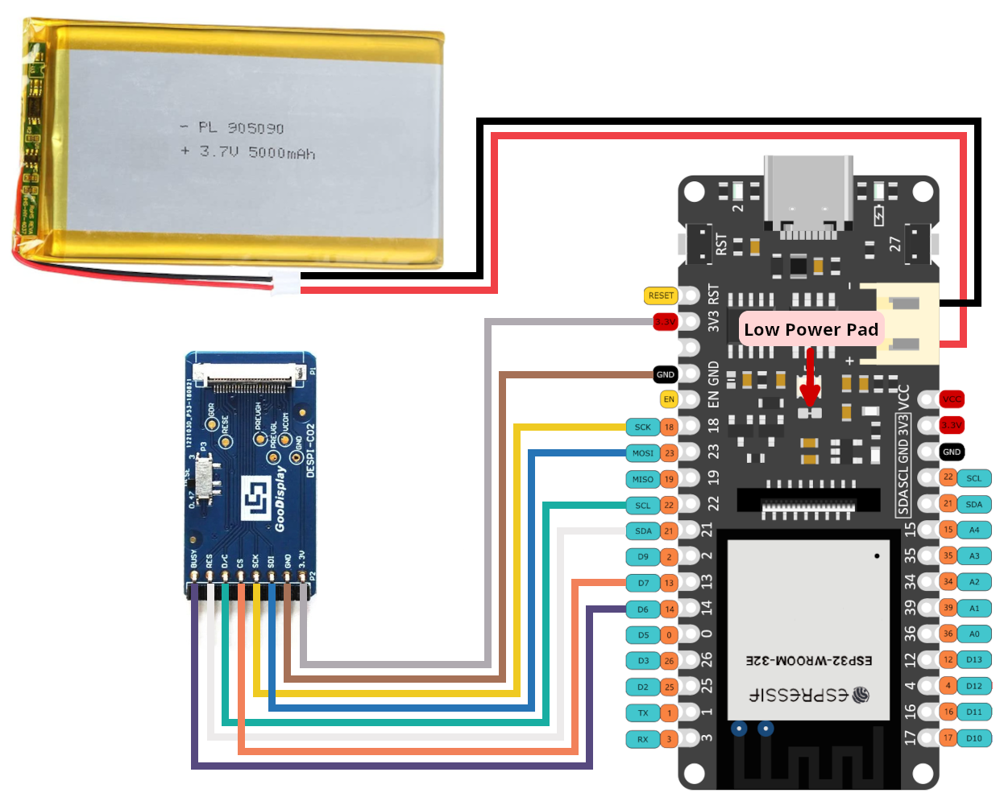

# ESP32 based E-Paper Meeting Room Display

If you work from home frequently and you have kids or a spouse working part-time you might find it difficult to signal if you're in a meeting right now or not.

While there might be "busy lights" available for purchase from Amazon to signal if you're available or not, I thought to myself "surely I could build that myself?".

And long and behold, my low-power meeting room display using a wifi-enabled ESP32 microcontroller and a 7.5" E-Paper display was born. It fetches Calendar data via [CalendarAPI](https://github.com/SpechtLabs/CalendarAPI) and not only prints an indicator if you're currently in a meeting or not, but it also shows a small overview of your schedule for the day, which I found super usefull. As soon as I enter my office, I already have an overview of my meeting schedule for the day.

The display also supports custom status messages and comes with an [HomeAssistant Integration](https://calendarapi.specht-labs.de/guide/home_assistant.html) so you can set custom status messages via HomeAssistant. In my case I use this if the resin 3D printer is running to display a biohazard icon and a status message reminding me of wearing a respirator.

## Credits

Huge thanks to [Luke Marzen](https://github.com/lmarzen) and his [ESP32 E-Paper Weather Display](https://github.com/lmarzen/esp32-weather-epd) project. It was a huge inspiration for me, and proved to be a very good starting point for me to base my display on.

## Required Components

| Component Type  | Component                            | Notes                                                     |
| --------------- | ------------------------------------ | --------------------------------------------------------- |
| ESP32           | FireBeetle 2 ESP32-E                 | Features low-power design, USB-C, and battery management. |
| E-Paper Display | See [Panel Support](#panel-support). | See [Panel Support](#panel-support).                      |
| Adapter Board   | DESPI-C02                            |                                                           |
| Battery         | 3.7V LiPo w/ JST-PH2.0 connector     | Any capacity (e.g., 5000mAh for 6+ months runtime)        |
| Enclosure       |                                      | See [Enclosure Options](#enclosure).                      |

Other items needed:

- Wires ("Jumper Wires" if looking to minimize/avoid soldering).
- Solder Iron + Solder
- Linux, Windows, or MacOS computer (used to configure and install ESP32 firmware).

### Panel Support

Refrain from using Waveshare Displays and jump straight to Good Display with a DESPI-C02 adapter board
Good Display make equivalent panels. Either variant will work.

| Panel                                         | Resolution | Colors          | Link                                                          |
| --------------------------------------------- | ---------- | --------------- | ------------------------------------------------------------- |
| Good Display 7.5in e-paper (GDEY075T7)        | 800x480px  | Black/White     | [Good Display](https://www.good-display.com/product/396.html) |
| Good Display 7.5in e-paper (GDEY075Z08)       | 800x480px  | Red/Black/White | [Good Display](https://www.good-display.com/product/394.html) |
| Good Display 7.3in e-paper (EOL) (GDEY073D46) | 800x480px  | 7-Color         | [Good Display](https://www.good-display.com/product/442.html) |

This software has limited support for accent colors. E-paper panels with additional colors tend to have longer refresh times, which will reduce battery life.

### Enclosure

I designed a simple enclosure with a sliding mechanism in [OnShape](https://cad.onshape.com/documents/a085c42da6149c918189f270/w/8138a9f47d2dacfe28cef74e/e/b4459c145c0eb402d3061e76?renderMode=0&uiState=6835c9c09d45ab7bb24c765b). You can also download the [STL files here](./stl/).

Please feel free to improve on the enclosure and contribute improvements back.

## Setup Guide

### Wiring

> **Warning**
> The polarity of JST-PH2.0 connectors is not standardized! You may need to swap the order of the wires in the connector.

The battery can be charged by plugging the FireBeetle ESP32 into the wall via the USB-C connector while the battery is plugged into the ESP32's JST connector.

> **Important**
> The DESPI-C02 adapter has one physical switch that MUST be set correctly for the display to work.
>
> - RESE: Set switch to position 0.47.

Cut the low power pad for even longer battery life.

- From <https://wiki.dfrobot.com/FireBeetle_Board_ESP32_E_SKU_DFR0654>

  > Low Power Pad: This pad is specially designed for low power consumption. It is connected by default. You can cut off the thin wire in the middle with a knife to disconnect it. After disconnection, the static power consumption can be reduced by 500 μA. The power consumption can be reduced to 13 μA after controlling the maincontroller enter the sleep mode through the program. Note: when the pad is disconnected, you can only drive RGB LED light via the USB Power supply.

### Configuration, Compilation, and Upload

[PlatformIO](https://platformio.org/) for VSCode is used for managing dependencies, code compilation, and uploading to ESP32.

1. Clone this repository or download and extract the `.zip`.
2. Install VSCode.
3. Follow [these instructions](https://platformio.org/install/ide?install=vscode) to install the PlatformIO extension for VSCode
4. Open the project in VSCode.
   1. `File` > `Open Folder...`
   2. Navigate to this project
5. Configure Options.
   - Configuration options are located in [config.h](include/config.h)
   - Important settings to configure in [config.h](include/config.h):
     - WiFi credentials (ssid, password)
     - [CalendarAPI](https://github.com/SpechtLabs/CalendarAPI) Endpoint
     - Timezone
     - Time and date formats
6. Build and Upload Code.
   1. Connect ESP32 to your computer via USB.
   2. Click the upload arrow along the bottom of the VSCode window. (Should say "PlatformIO: Upload" if you hover over it.)
      - PlatformIO will automatically download the required third-party libraries, compile, and upload the code. :)
      - You will only see this if you have the PlatformIO extension installed.
      - If using a FireBeetle 2 ESP32-E and you receive the error `Wrong boot mode detected (0x13)! The chip needs to be in download mode.` unplug the power from the board, connect GPIO0 ([labeled 0/D5](https://wiki.dfrobot.com/FireBeetle_Board_ESP32_E_SKU_DFR0654#target_5)) to GND, and power it back up to put the board in download mode.
      - If you are getting other errors during the upload process, you may need to install drivers to allow you to upload code to the ESP32.
